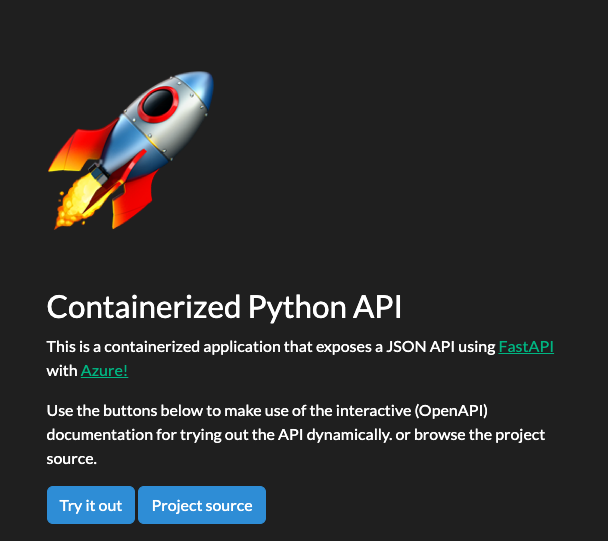
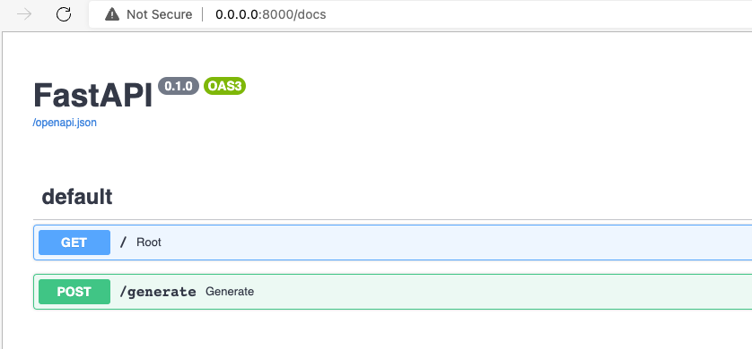
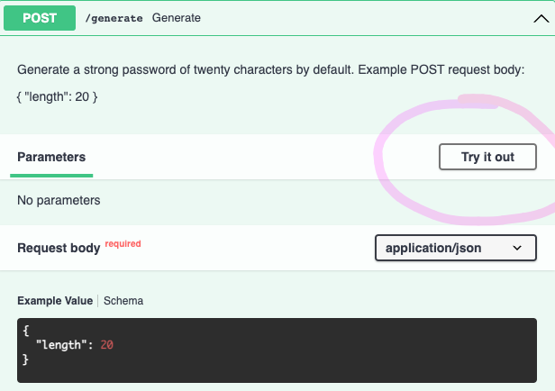

[](https://github.com/codespaces/new?hide_repo_select=true&ref=main&repo=526682400)

# Python RESTful API for use with GitHub Codespaces

_Run a Python API in this ready-to-use-repository in minutes_

With this template respository you can quickly get hands-on a Python project for running an HTTP API using the [Fastapi](https://fastapi.tiangolo.com/) framework. It will let you focus in working with the project instead of setting and configuring anything.



It's also ready to be used with [Codespaces](https://github.com/features/codespaces) a developer environment running in the cloud with [Visual Studio Code](https://visualstudio.microsoft.com/?WT.mc_id=academic-77460-alfredodeza)

<details>
   <summary><b>🎥 Watch the video tutorial to learn more about Codespaces</b></summary>

   [](https://aka.ms/CodespacesVideoTutorial "Codespaces Tutorial")
</details>

## For students and developers

Thanks to Codespaces, you can work on your projects without having [Visual Studio Code](https://visualstudio.microsoft.com/?WT.mc_id=academic-77460-alfredodeza) installed locally.

Using Codespaces you get [Visual Studio Code](https://visualstudio.microsoft.com/?WT.mc_id=academic-77460-alfredodeza) in the cloud, using a so called developer container. Like [Visual Studio Code](https://visualstudio.microsoft.com/?WT.mc_id=academic-77460-alfredodeza) installed locally, in this cloud version, you can install extensions, and use a terminal.

You can also configure your developer container to run a specific runtime and have it boot up with your favorite extensions.

- [webapp/](./.webapp) in this directory is your API, built with the Fastapi framework.
- [.devcontainer/Dockerfile](./.devcontainer/Dockerfile), So that you can configure what operating system the Codespace will use and how should the container be built.
- [.devcontainer/devcontainer.json](./.devcontainer/devcontainer.json), A configuration file used by Codespaces to configure [Visual Studio Code](https://visualstudio.microsoft.com/?WT.mc_id=academic-77460-alfredodeza), for example to add and enable an extension.

## 🧐 Try it out

Try out this template repository using Codespaces following these steps:

1. Create a repo from this template. Use this [create repo link](https://github.com/microsoft/codespaces-project-template-py/generate)
1. Navigate to the main page of the newly created repository.
1. Under the repository name, use the Code drop-down menu, and in the Codespaces tab, select "Create codespace on main".
   
1. Creating codespace

   

Next, we will run our app.

### Inspect your codespaces environment

What you have at this point is a pre-configured environment where all the runtimes and libraries you need are already installed - a 0 config experience.

> This environment will run the same regardless of whether your students are on Windows, macOS or Linux.

## Run API

The API included in this template repository has a single endpoint that generates a strong password. Get it up and running using the following steps:

1. Open up a terminal window by opening up the command palette (Ctrl-Shift-P or Cmd-Shift-P) and then select "Open new Terminal" command.
1. Run `uvicorn` in the console, it will start up your API:

    ```console
    uvicorn --host 0.0.0.0 webapp.main:app --reload
    ```

    You should see output similar to:

    ```output
    INFO:     Uvicorn running on http://127.0.0.1:8000 (Press CTRL+C to quit)
    INFO:     Started reloader process [28720]
    INFO:     Started server process [28722]
    INFO:     Waiting for application startup.
    INFO:     Application startup complete.
    ```

    You'll get a pop-up that says your application is available at port 8000. Click the button to open it in the browser.
1. Once the site loads, click on the _Try it Out_ button or append the following url part: `/docs` in the address bar. The self-documented API should load and look like this:

   
1. Finally, try to interact with the API by sending a request using the self-documented page. Click on the _POST_ button and then on the _Try it Out_ button:

   

## Customize the Codespace

You can change your environment. Let us take you through two different challenges that you are likely to want to do.

### Step 1: Change the Python environment

Let's say you want to change what version of Python is installed. This is something you can control.

Open [.devcontainer/devcontainer.json](./.devcontainer/devcontainer.json) and replace the following section:

```json
"VARIANT": "3.8-bullseye"
```

with the following instruction:

```json
"VARIANT": "3.9-bullseye"
```

this change will use Python 3.9 instead of 3.8.

### Step 2: Add an extension

Your environment comes with preinstalled extensions. You can change which extensions your codespaces environment starts with, here's how:

1. Open file [.devcontainer/devcontainer.json](./.devcontainer/devcontainer.json) and locate the following JSON element **extensions**:

   ```json
   "extensions": [
    "ms-python.python",
    "ms-python.vscode-pylance"
   ]
   ```

1. Add _"ms-python.black-formatter"_ to the list of extensions. It should end up looking like the following:

   ```json
   "extensions": [
    "ms-python.python",
    "ms-python.vscode-pylance",
    "ms-python.black-formatter"
   ]
   ```

   What you did above was to add the unique identifier of an extension of the Python [Black Formatter extension](https://marketplace.visualstudio.com/items?itemName=ms-python.black-formatter&WT.mc_id=academic-77460-alfredodeza). This will let Codespaces know that this extension should be pre-installed upon startup.

   Remainder: When you change any configuration on the json, a box will appear after saving.

   

   Click on rebuild. Wait for your codespace to rebuild the VS Code environment.

To find the unique identifier of an extension:

- Navigate to the extension's web page, for example [https://marketplace.visualstudio.com/items?itemName=ms-python.black-formatter](https://marketplace.visualstudio.com/items?itemName=ms-python.black-formatter&WT.mc_id=academic-77460-alfredodeza)
- Locate the *Unique Identifier* field under **More info** section on your right side.

## How to deploy

TODO

## Adding Ci/CD

TODO

## Resources

- [Fastapi](https://fastapi.tiangolo.com/)
- [Codespaces](https://github.com/features/codespaces)
